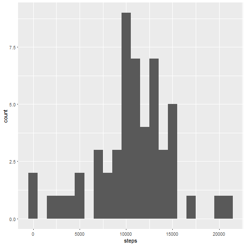
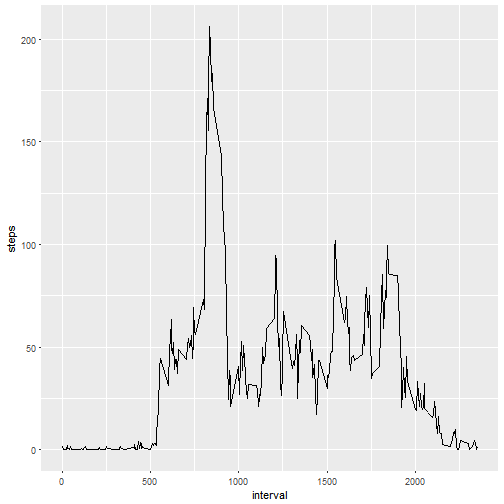
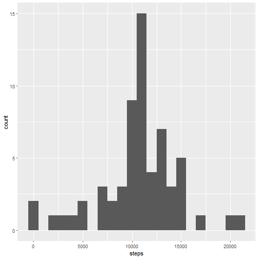
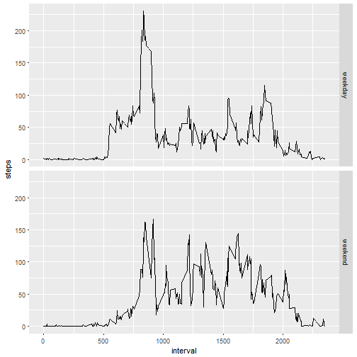

Course Project 1 - Activity Monitoring Data
===========================================

## Loading and preprocessing the data


```r
activity <- read.csv("activity.csv")
```

## What is the mean total number of steps taken per day?

### 1. Calculate the total number of steps taken per day

```r
perday <- aggregate(steps ~ date, data=activity, sum)
```

### 2. Create histogram of total number of steps taken each day

```r
library(ggplot2)
qplot(x = steps, data = perday, binwidth = 1000)
```



### 3. Calculate mean and median for steps taken per day

#### Median

```r
median(perday$steps)
```

```
## [1] 10765
```
#### Mean

```r
mean(perday$steps)
```

```
## [1] 10766.19
```

## What is the average daily activity pattern?

### 1. Time series plot of 5-minute interval and average steps taken

```r
dailyactivity <- aggregate(steps ~ interval, data=activity, mean)
```

```r
ggplot(dailyactivity,aes(interval,steps)) + geom_line()
```



### 2. Find interval with maximum number of steps

```r
subset(dailyactivity, steps == max(dailyactivity$steps))$interval
```

```
## [1] 835
```


## Inputting missing values

### 1. Calculate number of missing values in the dataset


```r
sum(is.na(activity$steps))
```

```
## [1] 2304
```

### 2/3. Fill in NA values with mean for that 5-minute interval across days

```r
merged <- merge(activity, dailyactivity, by = "interval", all.x = TRUE)
subsetna <- subset(merged, is.na(steps.x))
subsetna$steps.x <- subsetna$steps.y
merged <- rbind.data.frame(merged, subsetna)
merged <- subset(merged, !is.na(steps.x))
merged <- merged[-4]
names(merged)[2] <- "steps"
perday2 <- aggregate(steps ~ date, data=merged, sum)
```

### 4. Make histogram of new dataset and calculate mean and median


```r
library(ggplot2)
qplot(x = steps, data = perday2, binwidth = 1000)
```



#### Median

```r
median(perday2$steps)
```

```
## [1] 10766.19
```
#### Mean

```r
mean(perday2$steps)
```

```
## [1] 10766.19
```

Filling in the missing NA values does not alter the mean of the steps per day. However, the median is slightly increased. Also data is now included for six further days which previously had no valid step figures.


## Are there any differences in activity patterns between weekdays and weekends?

### 1. Create new factor variable for weekday and weekend


```r
merged$date <- as.Date(merged$date)
merged$day <- weekdays(merged$date)
subsetweekend <- subset(merged, merged$day %in% c("Saturday","Sunday"))
subsetweekend$day <- "weekend"
subsetweekday <- subset(merged, ! merged$day %in% c("Saturday","Sunday"))
subsetweekday$day <- "weekday"
merged <- rbind(subsetweekday,subsetweekend)
```

2. Make panel plot of interval and number of steps 

```r
dailyactivity2 <- aggregate(steps ~ interval + day, data= merged, mean)
ggplot(dailyactivity2,aes(interval,steps)) + geom_line() + facet_grid(day ~ .)
```



